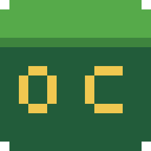

<div align="center">



# OoTCraft

### Play *The Legend of Zelda: Ocarina of Time* as Steve.

**Minecraft is the player. Hyrule is the world.** Mine into Kokiri Forest, build bridges over Hyrule Field, and
crawl, climb and fight your way through the real game, with Minecraft's hand, hotbar and blocks.

[](https://discord.gg/w5sxzdPtT7)
[](LICENSE)
[](#-free-and-legal)
[](LEGAL.md)
[](CONTRIBUTING.md)

**[Website](https://OWNER.github.io/OoTCraft/) · [Discord](https://discord.gg/w5sxzdPtT7) · [Install](#-install) · [Contribute](CONTRIBUTING.md) · [Legal](LEGAL.md)**

</div>

---

## ✨ What is it?

OoTCraft runs **Minecraft: Java Edition 1.21** and **[Ship of Harkinian](https://github.com/HarbourMasters/Shipwright)**
(the community PC port of Ocarina of Time) side by side, connected live through shared memory.

- 🧱 **Minecraft owns the player:** movement, camera, health, hunger, inventory, crafting, every 1.21 block and recipe.
- 🗡️ **Zelda owns the world:** Hyrule, every enemy, boss, NPC, cutscene, dungeon and the full story run in the real
  game.
- 🎥 **Press F5 to become Link:** third person with Zelda's own controls, items and pause menu. Press it again for
  Steve.

## 🎮 Features

| | |
|---|---|
| ⛏️ **Dig into Hyrule** | Mine Zelda's ground block by block. Below the surface is a **real Minecraft 1.21 world**: dirt, stone, deepslate, every ore, caves, aquifers, dungeons, mineshafts, geodes, trial chambers and ancient cities, down to bedrock. |
| 🏗️ **Build anywhere** | Place any Minecraft block in Hyrule with its real textures and 3D model (any resource pack). Link can stand on it, and hookshot to wood. |
| 🔥 **TNT and fire** | Blow craters into Hyrule, or light fires on Zelda's grass. |
| ⚔️ **Fight like Steve** | Minecraft weapons hit Zelda's enemies as real Zelda attacks, and Zelda's damage hurts Steve. |
| 🎒 **Zelda items in your hotbar** | Bombs, hookshot and everything else Link owns show up as Minecraft items. |
| 🧗 **Climb, crawl, swim** | Vines and ladders climb like Minecraft ladders, and you crawl through Zelda's crawlspaces in Minecraft's crawl pose. |
| 🧍 **You are Steve** | Link is drawn as Steve with **your own skin**, in the world and on the pause screen. |
| 💬 **The story still works** | Talk, read signs, open chests and watch cutscenes. Zelda takes over when it needs to, then hands control back. |

## 📥 Install

**You need:** Windows 10/11 · **your own** Ocarina of Time ROM · **your own** Minecraft: Java Edition (official
launcher, Microsoft account) · about 15 GB free · an internet connection.

1. **[Download OoTCraft](https://github.com/OWNER/OoTCraft/archive/refs/heads/main.zip)** and extract it.
2. Double-click **`Install-OoTCraft.bat`**. It:
   - installs the build tools it needs (Git, CMake, Python, Java 21, Visual Studio C++ Build Tools) with `winget`;
   - downloads the official Ship of Harkinian source and builds it **on your PC** with the OoTCraft patch;
   - adds an **OoTCraft** profile (Minecraft 1.21 + Fabric) to **your own Minecraft Launcher**;
   - puts an **OoTCraft** shortcut on your desktop.
3. Start **OoTCraft**. The first time, choose **your** Ocarina of Time ROM.
4. Load a save file. Your Minecraft Launcher opens: pick **OoTCraft** and press **Play**. Minecraft hides itself
   once it connects, and you're Steve in Hyrule.

> To uninstall, run `scripts\uninstall.ps1` (it keeps your worlds unless you add `-RemoveWorlds`).

## 🕹️ Controls

| Key | Minecraft mode (first person) | Link mode (F5, third person) |
|---|---|---|
| WASD, Space, Shift, Ctrl | Move, jump, sneak, sprint | Move, A button, R (shield) |
| Mouse | Look | Orbit the camera |
| Left click | Attack / mine (Hyrule's ground too) | B (sword) |
| Right click | Place / use, or talk on a "Speak / Open / Check" prompt | R (shield) |
| R | Zelda's A button (talk, doors, chests, signs) | |
| 1 2 3 · F | Hotbar | C-left, C-down, C-right · C-up |
| Q | | Z (target) |
| E | Minecraft inventory | |
| Enter | Zelda pause menu | Zelda pause menu |
| F5 or G | Switch to Link | Switch back to Steve |
| Esc | Ship of Harkinian menu (OoTCraft settings, Discord, world reset) | same |

## 🤝 Contribute: everyone's welcome

OoTCraft is **open source (MIT)** and built by its community. Code, testing, bug reports, ideas and docs are all
welcome.

- Read **[CONTRIBUTING.md](CONTRIBUTING.md)** to set up a development build in a few commands.
- Look for issues labelled `good first issue`, or bring an idea to the Discord.
- Please follow the **[Code of Conduct](CODE_OF_CONDUCT.md)**.

## 💬 Community

Join the **[OoTCraft Discord](https://discord.gg/w5sxzdPtT7)**, the social hub for OoTCraft: help with setup, bug
reports, development chat, screenshots of your builds in Hyrule, and news.

## ⚖️ Free and legal

- **OoTCraft is free. It is not sold, and never will be.**
- **This repository contains no copyrighted code or material** from Nintendo, Mojang or Microsoft: no ROMs, game
  code, game assets or Minecraft files, and no prebuilt Ship of Harkinian. Only original OoTCraft code, a patch to
  open-source Ship of Harkinian, and scripts.
- **You must own both games.** Ship of Harkinian builds its data from **your own** ROM dump. Minecraft runs through
  **your own** official launcher and Microsoft account; the mod refuses offline or unofficial accounts.
- **Unofficial fan project.** Not affiliated with or endorsed by Nintendo, Mojang, Microsoft, Fabric or
  HarbourMasters. All trademarks belong to their owners.
- **No warranty:** provided "as is" under the MIT License. Back up your saves.

Full details: **[LEGAL.md](LEGAL.md)**. Rights holders can reach the maintainers through an issue or the Discord.

## 🛠️ How it works

```
 Ship of Harkinian (visible window)                  Minecraft 1.21 + ootmc (hidden window)
 ──────────────────────────────────                  ──────────────────────────────────────
 Hyrule, actors, cutscenes, story        ◄───────►   player physics, camera, inventory, blocks
 draws the world + Minecraft's HUD layer   shared    collision copy of Hyrule (1/8-block voxels)
 Link = Steve, placed where Minecraft is   memory    stand-ins for Zelda's enemies
 Minecraft blocks drawn with real models   %TEMP%    block textures and models exported for Zelda
```

The Zelda side lives in `soh/soh/Enhancements/Minecraft/` (after the patch is applied). The Minecraft side is the
`ootmc` Fabric mod.

## 🙏 Credits

- **OoTCraft contributors:** everyone who has written code, tested or helped. Thank you!
- **[Ship of Harkinian](https://github.com/HarbourMasters/Shipwright)** by HarbourMasters, built on the
  **[zeldaret/oot](https://github.com/zeldaret/oot)** decompilation.
- **[Fabric](https://fabricmc.net/)**, the mod loader and API.
- Inspired by SkyCraft (Minecraft × Skyrim).

<div align="center"><sub>Made with ❤️ by fans, for fans. Free forever.</sub></div>
